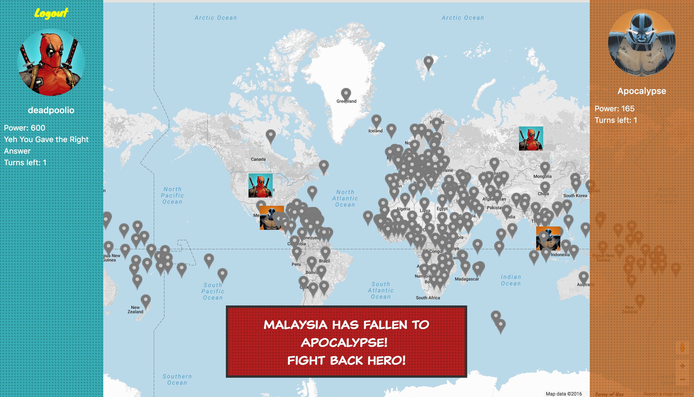
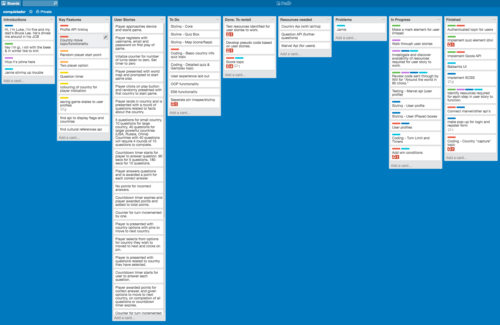
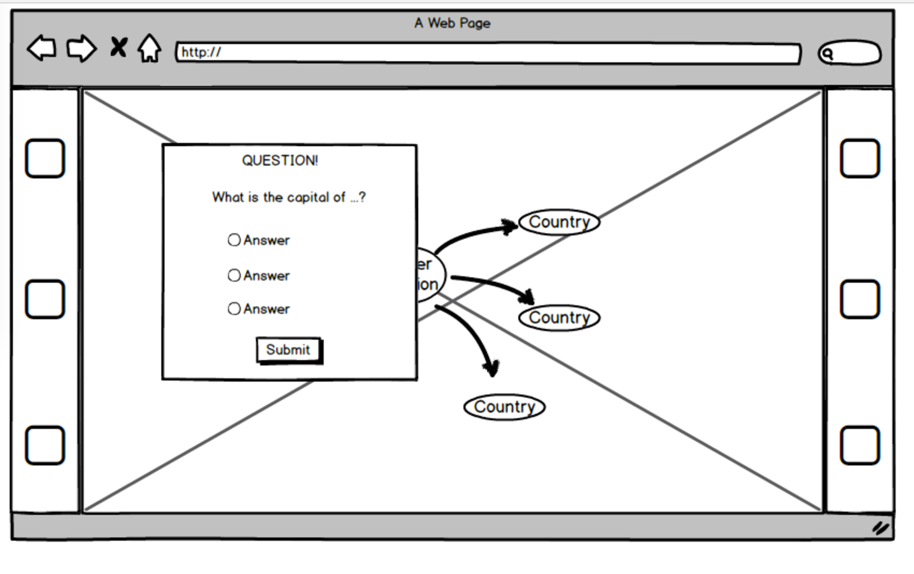
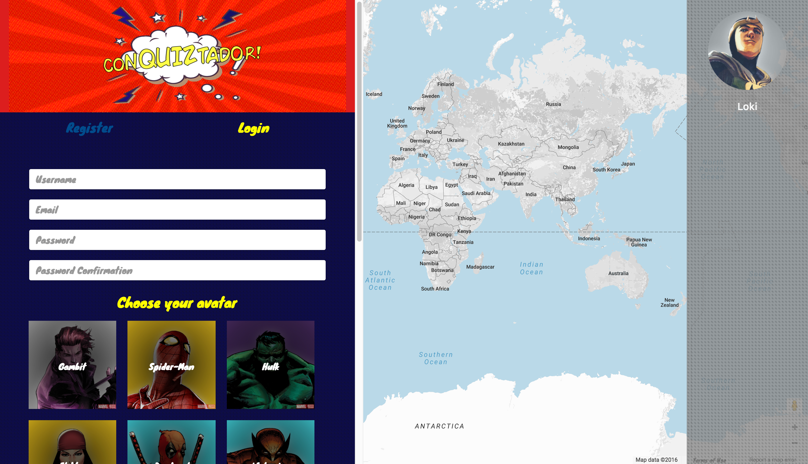
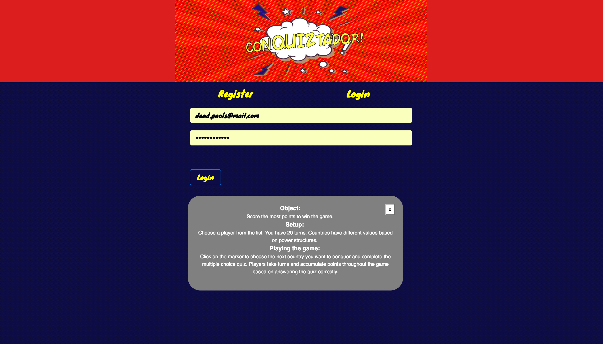
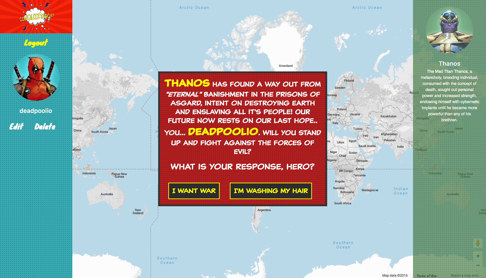
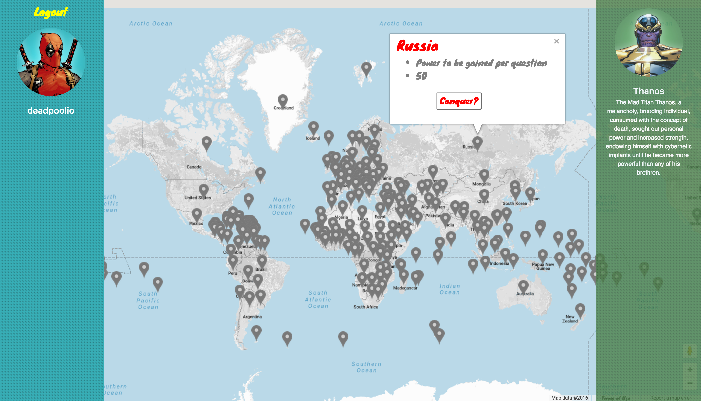
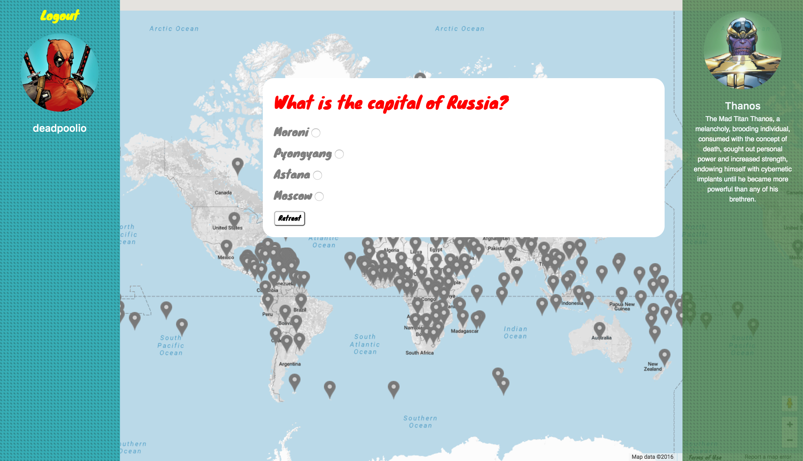
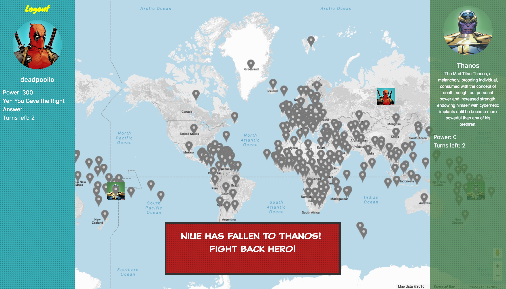
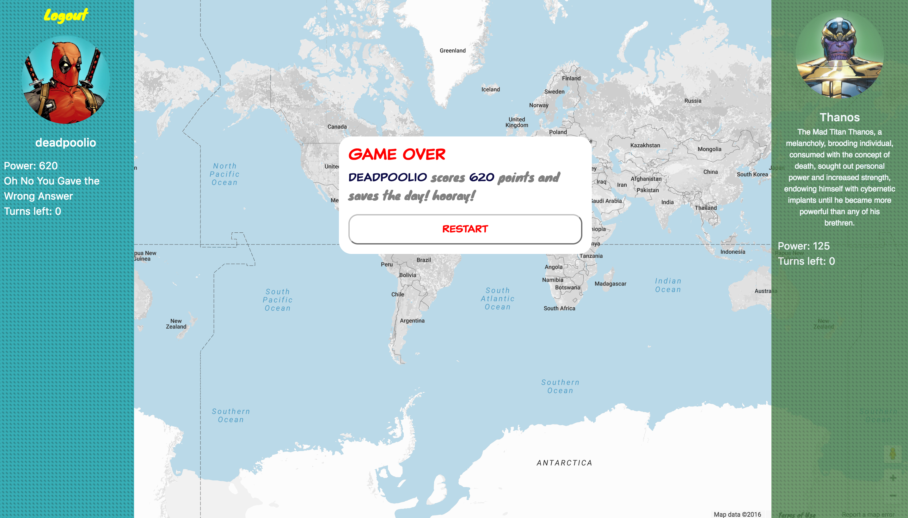

---
title: End of module 2 project.
type: Project
duration: "7 days"
creators:
    name: Jamie Simpson, Luke Hammond, Gisselle, John Evans
    city: London
competencies: Full Stack, RESTful intro.
---

# Project #2: A Full-stack Application:                                                         CONQUIZTADOR - Playing for Global Domination

## Introduction

THE CONQUIZTADOR TEAM: Jamie Simpsonn, Luke Hammond, Gi, John Evans.

Conquiztador: a game in which a player takes on the role of a marval superhero to defend the world against evil super villains played by an AI, intent on taking control of the world, by conquering countries and overtaking terretories. Points are accumulated by correctly answering questions about the countries the adversaries are seeking to conquer. 

---

# CONQUIZTADORS

Play the game [here](https://conquiztadors.herokuapp.com/)

---

### Overview

This project makes use of the materials taught in the second module of the WDI-23 programme and creates an application using frontend and backend technologies in order to develop an improved understanding of the techniques and approaches required to create and deploy a viable full stack apjplication, while working within a small team.

The solution is **a full-stack RESTful application** that includes a **Google Map** a **Marvel and REST Countries API** with provision for  **User authentication**. 

The application has been **built using an Express** with a **Mongo** database using the **Mongoose ORM** with a team of four using Git to manage workflow, version control and output coordination. 

---

### Technologies Used

The app has employed the following Technologies:

* **Team Workflow using Git and GitHub** 
* **Node.js, Express.js, Morgan, Nodemon**
* **MVC**
* **RESTful routing** 
* **AJAX**
* **NoSQL with MongoDB backed Models and Mongoose**
* **Bcrypt, JWT, Encrypted Passwords and Authentication**
* **Gulp** 
* **OAuth and Third Party APIs**
* **SASS**
* **Wireframes using Balsamic**
* **Semantically clean HTML** 
* **Deployed online via Heroku** 

---

### Preparation

The solution developed came about as a result of the passion for Marvel comic heros held by members of the team.

Tools such as Trello task planning, Balsamic wireframes, User stories and psuedo code, have been used to support  task coordination and alignement with the expected users experience. 

The outcomes and scope of requirements have been prioritised using the MoSCoW technique. At the outset of the project the following prioritised requirements have been defined.

### Outline of Application Requirements and Prioritisation

__MUST HAVE Application Requirements:__

* Single player game. (MUST HAVE)
* On subsequent turn, player selects next country to conquer. (MUST HAVE)
* Player to conquer country and gain territory based on correct answer to at least 50 percent of questions about country. (MUST HAVE)
* For small countries 5 questions, medium 10 questions,large 40 questions to be answered rounds of 4. (MUST HAVE)
* Questions will start with facts such as flag, population range etc. and gain increasing difficulty. (MUST HAVE)
* Player will accumulate points for each correct answer. (MUST HAVE)
* Correct answer to question by player will be indicated by flag pinned within country representing player (MUST HAVE)
* Player answering all questionss correctly will take control of country and gain territory. (MUST HAVE)
* Player unable to answer all questions correctly will accumulate points but will not take control of country, but can move on to another country to try to take control by correctly answering all questions. (MUST HAVE)
* Player score and countries conquered will be displayed (MUST HAVE)

__SHOULD HAVE Application Requirements:__

* At start country to conquer is selected randomly. (SHOULD HAVE)
* Option for two player game on same device (SHOULD HAVE)

__COULD HAVE Application Requirements:__

* Colour of country respresentation on map to change colour to indicate conquered country for each player. (COULD HAVE)
* Option for two player game on seperate devices (COULD HAVE)
* Timer for answering each question. (COULD HAVE) 
* Use a marvel comics API , maybe the user could choose a superhero to play (user a) and a villain (user b) so it'd be good vs. evil world domination. (COULD HAVE)
* Saving game states to user profiles. (COULD HAVE) 

__WON'T HAVE Application Requirements (Out of Scope):__

* Application will not support use on smartphones. (WON'T HAVE)

The team subdivided the project deliverables into modules with each member of the four person team developing the solution for each module based on the MUST HAVE priorities identified to achieve minimum viable product.

Over the course of the project the requirements and prioritisation has been continuously reviewed and refined to create a viable product.

---

###The Application

The solution developed is a **working full-stack application** game played against and AI. Although only six questions are field at present, the code allows for additional questions to be included through the provision of additional objects into an array of questions with defined properties. The player picks from a list of four options per question, while the AI will also randomly pick and answer from the list of four options per question.

In order to win the player must answer as many questions correctly once they have selected a country to conquer, bulding up power based on the country selected for each correct answer. The AI will pick an alternate country and randomly select answers to gain points, and will increase power based on the correct answers selected from is random pick of the answers available.

When the maximum number of set turns are completed the player with the greatest level of accumulated power based on the selected countries conquered, wins. 

The start the game a player is presented with a splash page and is invited to register and select an avatar.

A player is able to select a link to show game objectives and rules.

Once registered and loged in, a player is presented with a board game and invited to play.

If the player elects to start the game, they are able to pick a country by clicking on the marker for the country selected. On clicking the player is presented with an information pop-up indicating the country and power to be gained by conquering the country.

If the player chooses to try to conquer the country selected then they will be presented with a round of questions. Answering the first question correctly will enable the play to take the country, while the answering of subsequent questions allows the player to gain additional points and power.

Once a player answers all the available questions for the country selected or they answer a question incorrectly, the points accumulated will be added to the total score and the AI will be able to make its choice of country and will play by randomly selecting an answer to the questions provided for the AIs selected country and anounce which country has been conquered. 

After the maximum number of turns have been played, the winner will be announce with a game over prompt and an invitation to restart the game.

---

###Challenges faced

- Managing communications between team members in support of ensuring Git was correctly aligned with all updates.
- Resolving game question call function within quiz logic.
- Resolution of null fields in countries API dataset resulting in intermitent blank question pop up. 
- Issues with deployment of AI solution.
- Resolution of issues identified with Auth Key limits restricting access to Marvel API.
- Resolution of issues with registration and login functionality. 

###Where to from here?
The game could be improved in the following areas:

* The game has used some OOP functionaluty. Enabling full OOP will be a useful next step.
* Provisw the ability to have a second player on the same device or a seperate.
* Include audio themes depending on the super hero or villian selected.
* Include animation for selected super heros and villains.
* The inclusion of additional questions with five questions allocated to all countries but the most powerful which will be allocated ten questions.

###Bugs/Issues
- On occassions selecting a country to conquer displays a blank pop-up instead of a pop-/up with questions.
- On occassions when selecting a new country after a country has been conquered, a question pop-up appears instead of an info pop-up.

